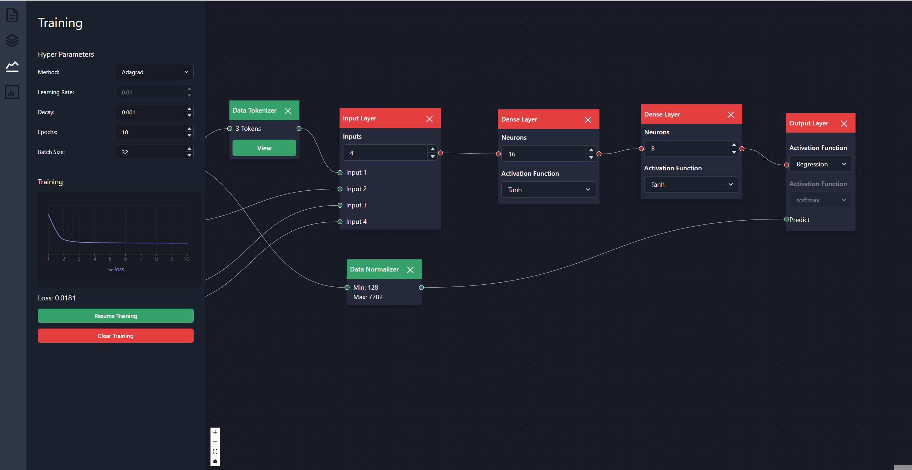

# 🧠 ML Grapher



ML Grapher allows you to create machine learning models from scratch with a visual graph tool right in your web browser

Made Possible using the following packages:
- **[🏠 Next.js](https://nextjs.org/):** web framework
- **[🎨 ChakraUI](https://chakra-ui.com/):** styling and layout
- **[📊 React Flow](https://reactflow.dev/):** visual graph
- **[🤖 Covnet.js](https://cs.stanford.edu/people/karpathy/convnetjs/index.html):** training models
- **[📦 Zustand](https://github.com/pmndrs/zustand):** state mangement

## Running Locally

Running the development server:

```bash
npm install # only need to run once

npm run dev
```

Open [http://localhost:3000](http://localhost:3000) with your browser to see the result.
